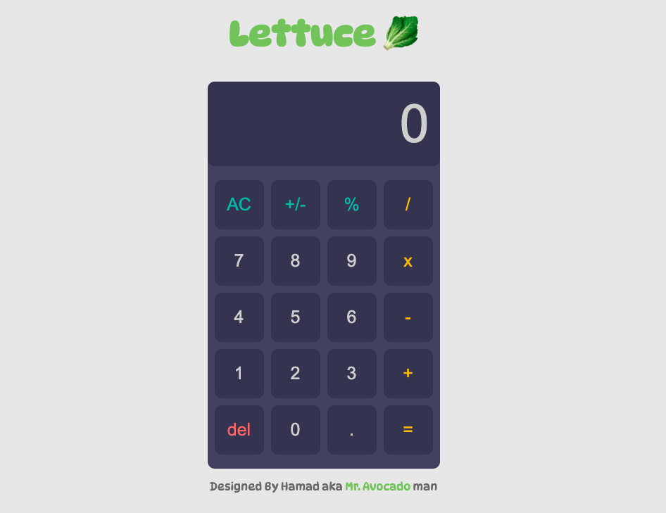

# 🧮 Calculator App

A simple calculator web app built with **HTML**, **CSS**, and **JavaScript**. This project was created as part of my journey to become a full-stack web developer, focusing on DOM manipulation, layout styling, and event-driven programming.

---

## 📸 Demo

Check out the live demo: [Calculator App](https://hamadsma.github.io/calculator-js-2/)



---

## 🚀 Features

- Perform basic arithmetic operations: **add, subtract, multiply, divide**
- **Clear** and **delete (backspace)** buttons
- Modern design
- Interactivity on cursor hover and clicks

---

## 🛠️ Built With

- HTML
- CSS
- JavaScript

---

## 📂 Clone Project

1. Clone the repository:
   ```bash
   git clone https://github.com/HamadSMA/calculator-app.git
   ```

## 🎯 Project Goals

- Practice JavaScript DOM manipulation and logic
- Build clean UI using CSS
- Strengthen fundamental web development skills

---

## ✅ To-Do List

- [ ] Add sound effects for button clicks
- [ ] Make a mobile friendly version
- [ ] Add keyboard functionality

---

## 👤 Author

**Hamad Alaslani**

- GitHub: [HamadSMA](https://github.com/HamadSMA)
- Email: hamadsmma@gmail.com
